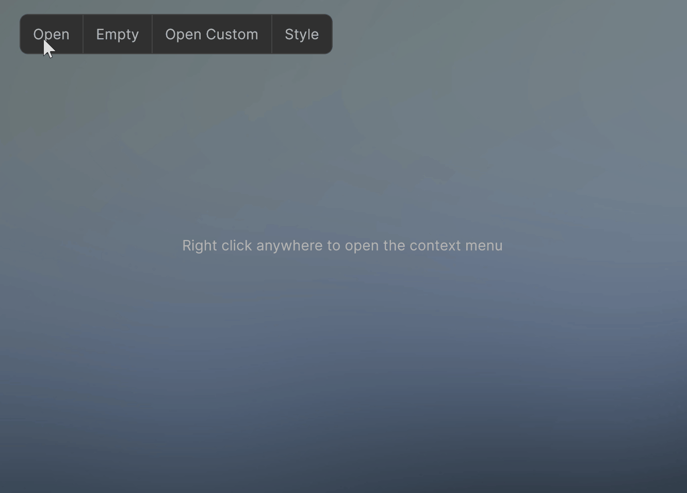
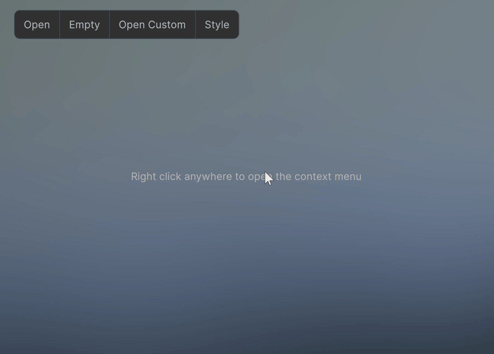
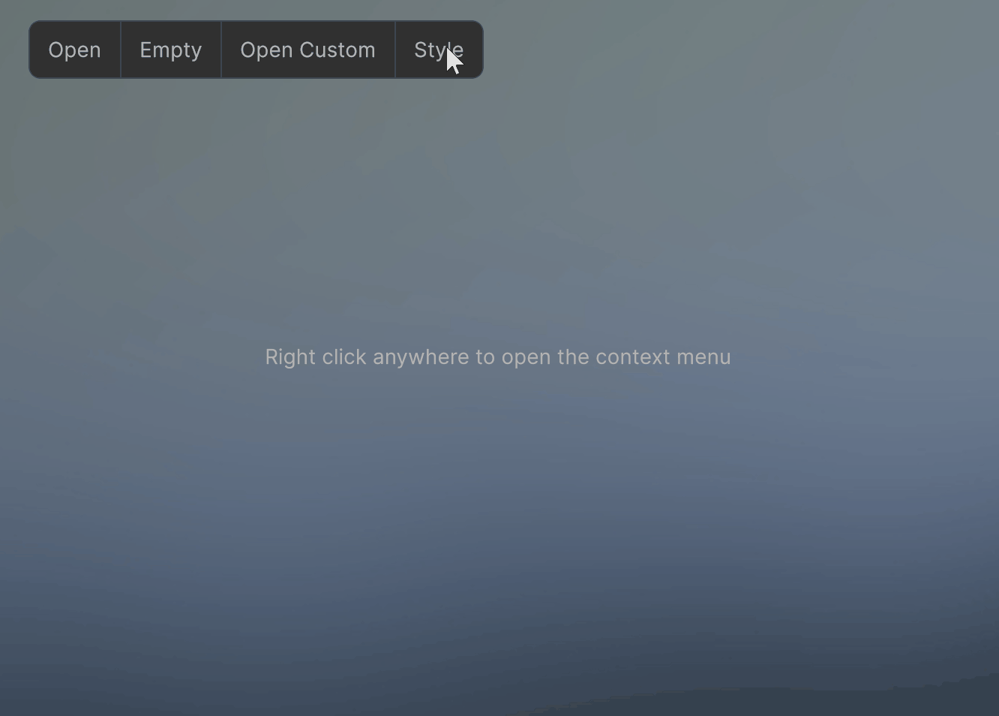

# Runtime dropdown for Unity's UI Toolkit

A runtime dropdown for Unity's UI Toolkit

It covers a multitude of use case such as toolbar dropdowns, context menus and enum dropdowns (see Samples)

The dropdowns are completely customizable through USS styling.

The dropdown's VisualElements are pooled to keep allocations to a minimum.

Supports the new Input System
