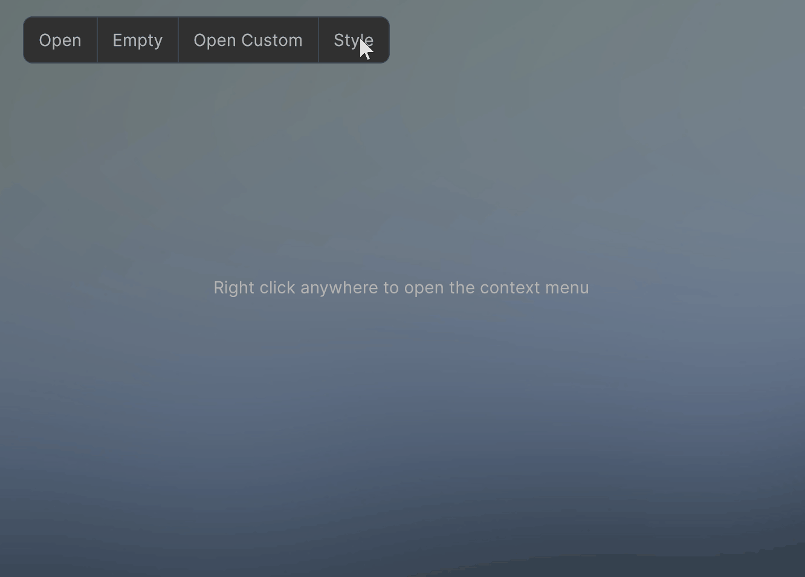

# Runtime dropdown for Unity's UI Toolkit

A versatile, runtime compatible dropdown for Unity's UI Toolkit.
This package covers a multitude of use case such as toolbar dropdowns, context menus and enum dropdowns (see Samples).

The dropdowns are completely customizable through USS styling.

The dropdown's VisualElements are pooled to keep allocations to a minimum.

*Compatible with Unity Version 2022.3 and higher.*

## Version 1.1 
New features:
- Better auto alignment to fit menus on the screen
- More advanced customization and styling options
- Improved focusing behavior

For all changes checkout the [changelog](/CHANGELOG.md).

Dropdown menus wrap around when they reach the end of the screen.

Context menus outside the screen area align to the border of the screen.

Dropdown menus can be customized through code and USS. Keyboard and Gamepad navigation is fully supported.

